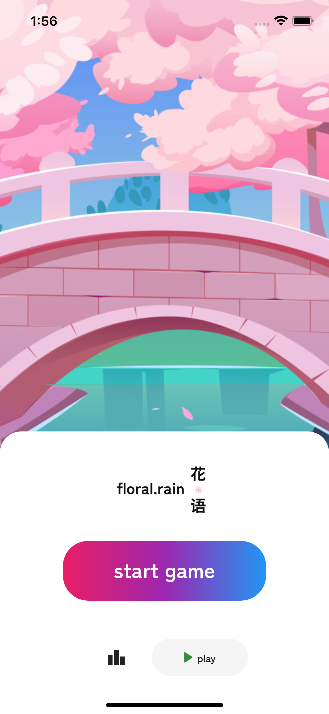
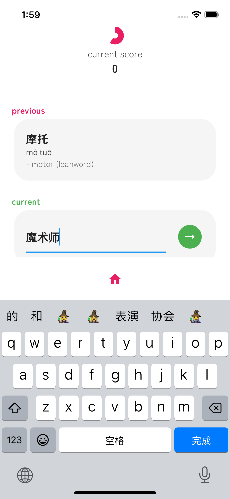
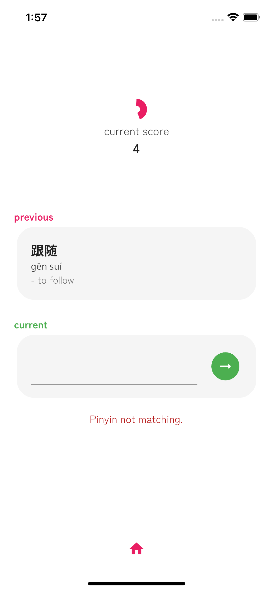
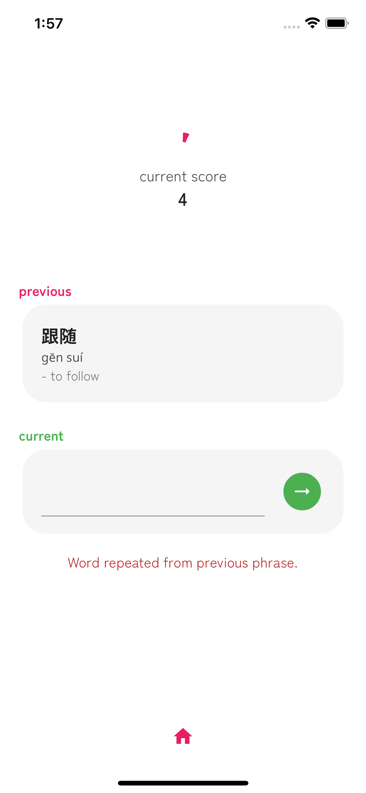

# Floral Rain

A Mandarin word game for Android and iOS designed to help Mandarin learners grow their vocabulary and improve their pinyin in a fun way.

Players chain phrases containing different words with identical pinyin to score points alongside a ticking timer. Successfully submitting a phrase refreshes the timer. To make things exciting, longer phrases grant exponentially more points!

Please find the repo for the backend API [here](https://github.com/Candyzorua/translator-server).

## Core Libraries

- [Flutter](https://flutter.dev/), frontend
- [Riverpod](https://riverpod.dev/), state management
- [Express](https://expressjs.com/), backend API
- [MongoDB](https://www.mongodb.com/), data management

## Visuals

#### Gameplay demos

#### Start Game Page

  

#### Stats Page

  

#### In-game Page

  
  
  

#### Game Over Page

  

## Attributions
- Sakura bridge image from **Yuliya Pauliukevich** on Vecteezy.
- Falling sakura flowers image from **Freepik**.

