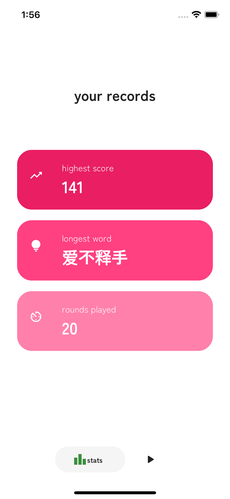

# Floral Rain

A Mandarin word game for Android and iOS designed to help Mandarin learners grow their vocabulary and improve their pinyin in a fun way.

Players chain phrases containing different words with identical pinyin to score points alongside a ticking timer. Successfully submitting a phrase refreshes the timer. To make things exciting, longer phrases grant more points!

Please find the repo for the backend API [here](https://github.com/Candyzorua/translator-server).

## Core Libraries

- [Flutter](https://flutter.dev/), frontend
- [Riverpod](https://riverpod.dev/), state management
- [Express](https://expressjs.com/), backend API
- [MongoDB](https://www.mongodb.com/), data management

## Visuals

#### Gameplay demos
Taken using the iPhone 14 simulator.

##### All features
https://github.com/Candyzorua/floral_rain/assets/75513525/7537434f-77ec-4e11-9b87-d46cda62233b

##### Main gameplay
https://github.com/Candyzorua/floral_rain/assets/75513525/f2b3fe44-b0d0-4241-b82a-2079cdf88a70

#### Start Game Page

  

#### Stats Page

  

#### In-game Page

  
  
  

#### Game Over Page

  

## Progress Log

#### Completed
- [24/8/2023] Completed main gameplay functionality. Data persistence is not implemented, mock data is being used in stats page.

#### In Progress
- Implement data persistence.
- Move backend from Express+MongoDB to a cloud-based solution like Google Firebase.
- Clean dictionary data so all pinyin can be rendered properly.
- Implement settings page and allow users to adjust time limit etc.

## Attributions
- Sakura bridge image from **Yuliya Pauliukevich** on Vecteezy.
- Falling sakura flowers image from **Freepik**.
- Chinese dictionary data from [CC-CEDICT](https://www.mdbg.net/chinese/dictionary?page=cedict).

